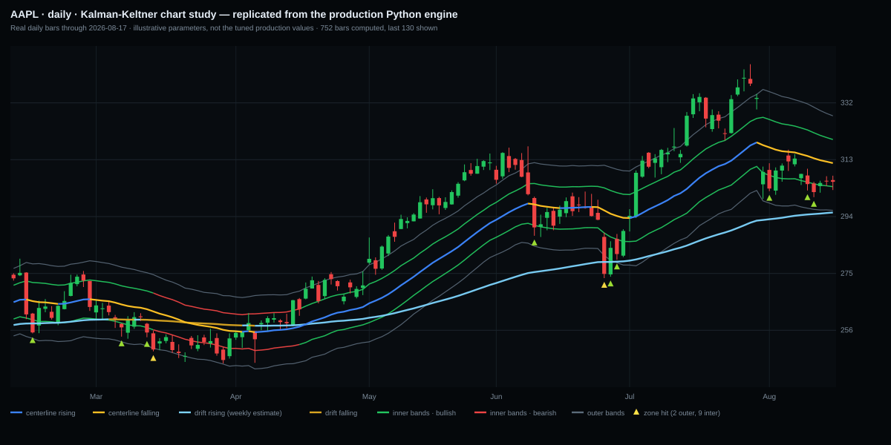
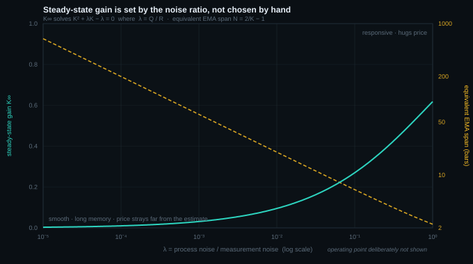
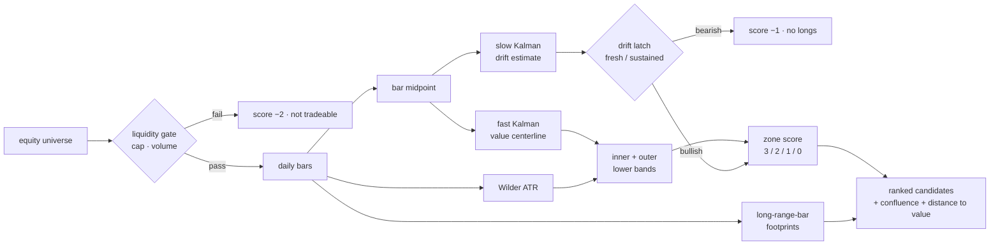
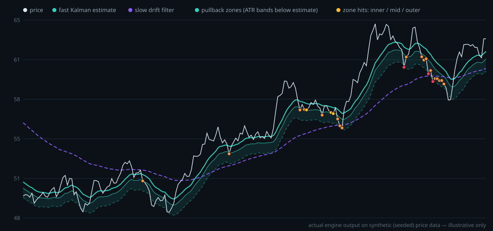

# Kalman-Keltner Scanner

**A swing-trade pullback scanner built on a dual-speed Kalman filter pair with ATR-graded
value zones** — implemented twice: as TradeStation (EasyLanguage) RadarScreen studies for
live universe scanning, and as a parity-ported NumPy engine that powers the screening
backend of my options-screener project.

Personal project, designed and built solo. This is a **showcase repository** — the tuned
signal parameters and full source are private, but the model, the math, and the design
reasoning are all here, and I'm happy to walk through the implementation in detail. See
also [OptBridge](https://github.com/THEGRISC/OptBridge), my options portfolio monitor.

> Rendered by the production Python engine on real daily bars. Parameters are illustrative
> round values, **not** the tuned production set, so the geometry is representative but the
> exact band distances and turn timing are not the live configuration.

## The problem

Every pullback scanner needs to answer two questions: *where is this instrument actually
valued right now*, and *how far has price strayed from that value*. Moving averages answer
the first one badly. They force a trade-off with no good setting: a fast average whipsaws
and drags the reference point down into the pullback you were trying to measure, while a
slow one lags so far behind that "distance from the average" mostly measures the lag rather
than the dislocation.

The deeper issue is that a moving average is a *filter chosen by hand*. You pick a length
because it looked reasonable on a chart. There's no model underneath saying why 20 and not
34. The Kalman filter starts from the opposite end: state your assumptions about how value
moves and how noisy your observations are, and the optimal filter — including its
smoothing constant — falls out of those assumptions.

---

## Part 1 — The Kalman filter

### The model

The scanner assumes a **local level model**, the simplest useful state-space form. There is
a latent "fair value" $x_t$ that we never observe directly. It drifts as a random walk:

$$x_t = x_{t-1} + w_t, \qquad w_t \sim \mathcal{N}(0, Q)$$

Each bar gives us one noisy look at it:

$$z_t = x_t + v_t, \qquad v_t \sim \mathcal{N}(0, R)$$

$Q$ is the **process noise** — how much genuine repricing we believe happens between bars.
$R$ is the **measurement noise** — how much of what we observe is microstructure junk rather
than real information. Everything the filter does follows from the relationship between
those two numbers.

### The recursion

Because the state is scalar and both the transition and observation matrices are 1, the
full Kalman recursion collapses to four lines per bar:

$$
\begin{aligned}
\text{predict:} \quad & \hat{x}_t^- = \hat{x}_{t-1}, \qquad P_t^- = P_{t-1} + Q \\
\text{gain:} \quad & K_t = \frac{P_t^-}{P_t^- + R} \\
\text{update:} \quad & \hat{x}_t = \hat{x}_t^- + K_t\,(z_t - \hat{x}_t^-) \\
\text{covariance:} \quad & P_t = (1 - K_t)\,P_t^-
\end{aligned}
$$

$P$ is the filter's own uncertainty about its estimate. The prediction step *widens* it (we
just let a bar pass without looking, so we know less), and the update step *narrows* it (we
just got information). The gain $K_t$ is the fraction of the observation-vs-prediction
error we actually act on, and it is a ratio of uncertainties: how unsure we are about our
estimate, relative to how unsure we are about our estimate plus the observation. When our
own uncertainty dominates, we trust the new data. When the observation is mostly noise, we
barely move.

### Why this is the right tool, not just a fancier average

**It's optimal, not heuristic.** For a linear-Gaussian state-space model the Kalman filter
is the minimum-mean-square-error estimator of the state given every observation up to $t$.
Drop the Gaussian assumption and it is still the best *linear* unbiased estimator. So if you
accept the two modelling sentences above, the recursion isn't one option among many — it is
the answer, and the smoothing constant is derived rather than chosen.

**It costs O(1) per bar.** No window to slide, no history to re-scan. When the scanner is
sweeping a full equity universe every day, a filter that carries its entire past in two
floats is the difference between a workable screen and an overnight batch job.

**It anneals its own warm-up.** The filter starts with a deliberately large $P$, meaning
"I have no idea where value is." That makes the early gains close to 1, so the estimate
snaps onto price almost immediately, then tightens as $P$ decays toward steady state. A
plain EMA has a seeding problem that you paper over with a burn-in period; here the correct
warm-up behavior is a consequence of the model rather than a patch on top of it.

### Steady state: the filter *is* an EMA, but one you derived

With $Q$ and $R$ held constant, the covariance converges. Setting $P_t^- = P_{t-1}^-$ in the
recursion and writing $\lambda = Q/R$ for the signal-to-noise ratio gives

$$K_\infty^2 + \lambda K_\infty - \lambda = 0 \qquad\Longrightarrow\qquad K_\infty = \frac{-\lambda + \sqrt{\lambda^2 + 4\lambda}}{2}$$

and the update line becomes

$$\hat{x}_t = (1 - K_\infty)\,\hat{x}_{t-1} + K_\infty z_t$$

which is exactly an exponential moving average with smoothing constant $\alpha = K_\infty$,
equivalent to a span of $N = 2/K_\infty - 1$ bars.

This is worth being blunt about rather than hiding, because it's the honest version of the
story: **in the long run this filter is an EMA whose length was derived from an explicit
statement about how much of price is signal.** What you gain over just picking an EMA length
is that the parameter now means something you can reason about and defend, the warm-up is
principled, and — as the next section shows — a *second* timescale can be generated from the
same model by a single change of the noise ratio, instead of by loading a second data feed.

Note also that $K_\infty$ depends only on the **ratio** $\lambda = Q/R$. Scaling both noises
together changes nothing at steady state; it only changes how fast the transient settles.
Treating $Q$ and $R$ as two independent knobs is a common mistake.

### Why the bar midpoint is the right observation

The observation fed to the filter is not the close. It is the bar midpoint,
$z_t = (H_t + L_t)/2$. This matters more than it looks.

The state we are trying to estimate is *where this instrument is currently valued* — not
*what the last print happened to be*. The close is a single sample at a single instant, and
it is the instant most exposed to noise that has nothing to do with value: closing-auction
imbalance, one aggressive sweep into the bell, a stale quote on a thin name. Under the model
the measurement error $v_t$ is supposed to be zero-mean noise around the true level, and a
bar's closing print is a poor draw from that distribution — it is the *endpoint* of the
bar's path, not its center.

The midpoint uses the bar's extremes instead, so it estimates the center of the excursion
price actually made. If price diffuses within the bar, the endpoint of that path scatters
widely around the path's central location while the midrange sits much closer to it. This
is the location analogue of the well-known result behind range-based volatility estimators
(Parkinson): the high and the low jointly carry more information about a bar than either
endpoint does, so statistics built from the range are more efficient per bar than
close-to-close ones. Feeding the filter a lower-variance observation means, for the same
$\lambda$, a cleaner estimate — or equivalently, you can afford to run at a higher gain for
the same amount of jitter.

**Where this argument stops.** The midpoint is not volume-weighted: it says nothing about
where trading actually concentrated inside the bar, and a single long wick drags it toward
price levels that barely traded. On a gap bar, the midpoint can sit in a range where
essentially nothing changed hands. A volume-weighted center would be better-centered in
principle, but it isn't uniformly available across a scanning universe and it complicates
the causal, one-pass structure that makes the screen cheap. The long-range-bar overlay
described below exists partly to compensate: it re-introduces a volume-and-range-aware
footprint on top of a filter that is deliberately price-only.

### The honest caveat about adaptivity

With $Q$ and $R$ fixed, the covariance path $P_t$ is fully deterministic — it does not depend
on the data at all. So this filter is only "adaptive" during its transient; after
convergence it applies the same gain forever, whether the tape is calm or violent. Calling
it an adaptive filter in the strong sense would be overselling it. A genuinely adaptive
version would estimate $Q$ and $R$ online (innovation-based adaptive filtering, or an IMM
running several models in parallel), and that is the most interesting direction for future
work here. What the current design gets is a *principled* constant, not a *responsive* one,
and the ATR bands — which do react to volatility — are what carry the adaptivity in this
system.

---

## Part 2 — Drift: a second timescale from the same data

### One feed, two horizons

The scanner runs the identical recursion a second time, changing only the noise pair:
process noise is divided by a multiplier $m$, and measurement noise is multiplied by it.
The effect on the signal-to-noise ratio compounds:

$$\lambda_{\text{drift}} = \frac{Q/m}{R \cdot m} = \frac{\lambda}{m^2}$$

and since $K_\infty \approx \sqrt{\lambda}$ for small $\lambda$,

$$K_{\text{drift}} \approx \frac{K_{\text{fast}}}{m} \qquad\Longrightarrow\qquad N_{\text{drift}} \approx m \cdot N_{\text{fast}}$$

So splitting the noises in opposite directions by $m$ lengthens the filter's effective
memory by very close to a factor of $m$. Set $m$ to the number of trading bars in the
higher timeframe you care about and the identity becomes concrete:

> **The drift line on a daily chart is the Kalman estimate of the weekly chart.**

It is not an approximation of a weekly *trend* in some loose sense — it is what the fast
filter would produce if you fed it weekly bars, recovered from the daily series by
stretching the filter's memory instead of resampling the data. That's the piece of this
design I'm happiest with: **multi-timeframe context from one feed, with no second data
subscription, no resampling, and no alignment bugs** — the two most common sources of
silent error in multi-timeframe systems, both removed by construction rather than by
careful bookkeeping.

It also means the daily chart alone carries both horizons. You are never comparing two
charts and reconciling them by eye; the weekly read is drawn on the daily chart, in a
colour, at the same scale as everything else.

### From a smooth line to a regime state

The drift estimate is not used as a level. It is used as a **direction**, by comparing it to
its own value a fixed number of bars back and feeding that into a latching state machine
with four states: fresh bullish, sustained bullish, fresh bearish, sustained bearish. A turn
registers as "fresh" on the bar the comparison first flips, and ratchets to "sustained" while
it persists. The distinction matters because a freshly-turned drift and a drift that has
been rising for months are different trade contexts even though both are "up."

Everything here reads strictly backwards — the latch only ever looks at prior state and a
prior bar's estimate — so there is no look-ahead anywhere in the chain.

### Why a mean-reversion scanner needs a trend gate

This is the part that makes the difference between a pullback scanner and a falling-knife
generator. Distance below a value estimate is a *bullish* signal only if value is holding or
rising. In a genuine downtrend, price is below the estimate more or less continuously, and
the estimate follows it down — so an ungated version fires constantly and each signal is
just "this thing is still falling." Gating on the slow filter's direction means the scanner
only hunts longs while the higher-timeframe bias is up, and reports bearish drift as an
explicit *do-not-take-longs* state rather than silently returning nothing.

---

## Part 3 — Keltner channels

### What they are

A Keltner channel in its modern form is a moving-average center with bands set a multiple of
**Average True Range** above and below it. True range is

$$TR_t = \max\big(H_t - L_t,\; |H_t - C_{t-1}|,\; |L_t - C_{t-1}|\big)$$

and ATR is Wilder's recursive smoothing of it, $ATR_t = ATR_{t-1} + (TR_t - ATR_{t-1})/n$,
seeded with a simple average of the first $n$ true ranges. That seed-then-smooth detail is
exactly how TradeStation's `AvgTrueRange` behaves, and reproducing it precisely is what
lets the Python port agree with the EasyLanguage original bar for bar.

### Why ATR rather than standard deviation

The obvious alternative is a Bollinger band: center ± a multiple of the standard deviation of
closes. Two reasons this design uses ATR instead.

**True range sees gaps; a standard deviation of closes does not.** The $|H_t - C_{t-1}|$ and
$|L_t - C_{t-1}|$ terms explicitly measure the jump from the previous close into this bar.
For equities — which gap on earnings, guidance, and overnight news constantly — a volatility
measure that only looks at closing prices systematically understates how far the instrument
actually travels, and therefore draws bands that are too tight on exactly the names where
risk is highest.

**It keeps the center and the width independent.** Bollinger bands measure the dispersion of
the same series they average, so the center and the width are two views of one computation.
Here the center comes from a state-space estimate of value and the width comes from an
independent measure of realized excursion. They can disagree, and that disagreement is
informative: a quiet drift-up with compressing ATR is a different setup from the same drift
with ATR expanding, and the zone geometry reflects it.

---

## Part 4 — Putting them together

### Distance measured in the instrument's own units

The center is the fast Kalman estimate; the zone boundaries are that center minus ATR
multiples. So what the scanner is really computing, per symbol, is

$$\text{displacement} = \frac{\text{Kalman estimate} - \text{Close}}{ATR}$$

a **volatility-normalized dislocation**. This is the property that makes a cross-sectional
scan meaningful at all: it puts a mega-cap that moves 1% a day and a small-cap that moves 6%
a day on one comparable axis. Ranking raw percentage pullbacks would simply sort the
universe by volatility every single day. Ranking in ATR units asks the actually interesting
question — *which of these names is unusually far from its own value, by its own standards*.

### A graded ladder, not a binary trigger

Two multipliers define an inner and an outer lower band, which carve the space below the
estimate into three depths. Every candidate gets a score:

| Score | Meaning |
|---|---|
| **3** | Outer zone — deepest dislocation, highest conviction |
| **2** | Between the bands — the classic pullback |
| **1** | Inner zone — light pullback, price just under the estimate |
| **0** | Drift is bullish but price isn't in a zone |
| **−1** | Drift is bearish — no longs |
| **−2** | Failed the liquidity gate — not tradeable, don't even rank it |

Grading rather than triggering is a deliberate choice. A binary signal throws away the
information that one setup is twice as stretched as another, and it forces the threshold to
carry all the weight. A sorted score column means the daily workflow is "look at the top of
the list" rather than "hope the threshold was set right," and the negative codes make the
*reasons for exclusion* visible instead of silently dropping names.

Each band also carries a small proximity cushion, scaled as a percentage of price so it
behaves consistently on a \$20 stock and a \$600 one. Without it, zone membership is a
brittle exact-touch test that misses setups by pennies.

### Volume confluence

A separate, causal overlay flags **long-range bars** — bars whose range is an unusual
multiple of their recent average — and remembers the low of a bullish one as support (or the
high of a bearish one as resistance) until price decisively pierces it. The scanner then
reports whether current price is sitting near such a footprint. This is confluence, not a
gate: it doesn't change the score, it tells you whether the statistically-defined value zone
happens to line up with a level where heavy, wide-range trading actually occurred. As noted
above, it's also the piece that partially answers the "the midpoint ignores volume"
objection to the filter itself.

### Liquidity first

The universe gate runs before anything else and is deliberately the cheapest computation in
the chain — market cap and average volume, with a dollar-volume fallback for names whose
fundamentals feed comes back empty so they aren't unfairly discarded. Names that fail are
scored −2 and never considered. Sorting a beautiful signal over instruments you can't get
filled in is the most common way a scanner produces backtest results it can never realize.

### The whole chain

---

## Reading the chart

The scanner ranks; the companion chart study is what you look at before committing. Its
visual encoding is built so that the two questions — *where is price relative to value* and
*what is value itself doing* — are answered by position and colour independently.

| Element | Encoding |
|---|---|
| **Fast Kalman centerline** | Coloured by its own slope: **blue** while the value estimate is rising, **yellow** while it is falling |
| **Drift line** | Same idea, its own palette: **light blue** while the slow estimate is rising, **gold** while it is falling. Remember this line is the *weekly* Kalman estimate drawn on the daily chart |
| **Inner Keltner bands** | Inherit the drift's state: **green** in bullish drift, **red** in bearish drift |
| **Outer Keltner bands** | Neutral — pure geometry, carrying no state |

All four are visible in the chart at the top of this page: the centerline flips yellow
through the February–April decline and blue again from May, and the inner bands run red for
exactly the stretch where the drift is falling, turning green as it recovers. The markers
underneath the bars are the bars where the zone score actually fired.

Colouring a line by its own slope means the derivative is read directly off the chart
instead of from a second indicator, and it is what makes the **pullback-versus-reversal**
distinction visible at a glance. Price sitting on the lower bands is the same *location* in
all of the following cases, but they are not the same *situation*:

- **Centerline still blue, drift still light blue** — value is advancing and price has
  fallen away from it. A dislocation inside an advance, which is the setup the scanner is
  built to find.
- **Centerline turned yellow while drift is still light blue** — the estimate of value has
  itself started to fall, even though the higher-timeframe bias hasn't given way. The
  dislocation is no longer just price leaving value behind; value is now following price
  down. Early warning that a dip may be turning into something else.
- **Inner bands turned red** — drift has flipped bearish, and a low print is no longer a
  pullback in an uptrend at all. This is the state the screener reports as its no-longs
  code rather than as a setup.

Because the bands take their colour from the drift and their position from the fast
estimate plus ATR, a single glance carries the whole model state: colour is *permission*,
position is *location*, and width is *volatility*.

---

## Parameters — what each one does

The tuned values are private, but here is the full set of knobs and what moving each one
does to the output. Read this as the design's sensitivity map.

| Parameter | Controls | Raising it | Lowering it |
|---|---|---|---|
| **Process noise** $Q$ | How much genuine repricing is assumed per bar | Higher gain: the center chases price, sits closer to it, and recentres quickly — pullbacks read as shallower because the reference moved down with price | Smoother center; price strays further before the estimate follows, so dislocations read deeper and persist, at the cost of acknowledging a real regime change later |
| **Measurement noise** $R$ | How much of each bar's midpoint is treated as junk | Lower gain — smoother, laggier, deeper apparent dislocations | More responsive center. Note this is the mirror of $Q$: at steady state **only the ratio matters**, and the absolute magnitudes affect nothing but the warm-up transient |
| **Drift multiplier** $m$ | Separation between the fast and slow timescales | A slower, steadier regime gate that turns later and flips less — fewer false direction changes, more late entries | The drift filter converges toward the fast one; at small $m$ the gate stops filtering anything, because both filters agree by construction |
| **Drift lookback** | How far back the drift estimate is compared to call it rising or falling | Fewer and later direction flips; small wiggles in the slow line stop registering | Noisier regime calls and more churn between fresh-bullish and fresh-bearish |
| **ATR length** | The volatility window setting band width | Smoother, slower-adapting bands that stay wide for a long time after a volatility spike, keeping zones deep | Bands breathe with recent volatility and tighten quickly after a contraction, so zone membership turns over faster |
| **Inner multiplier** | Where the shallow zone begins, in ATR units | The light-pullback zone starts further from value; fewer names register as mildly stretched | Almost any dip registers, and the shallowest score loses discriminating power |
| **Outer multiplier** | Where the deep zone begins | The deepest score becomes rare and more selective — high conviction, few candidates, and some days none at all | Many names reach the top score, which raises signal count and lowers average selectivity |
| **Band proximity** | Tolerance cushion above each band | More near-miss bars count as in-zone; more signals, slightly looser definition of "at the band" | A strict touch is required and setups get missed by pennies |
| **Long-range-bar factor** | What counts as an unusually wide bar | Only genuine outlier bars leave a footprint; confluence hits become rare and more meaningful | Ordinary bars qualify and the confluence flag turns into noise |
| **Range lookback** | The baseline "normal" range a bar is compared against | A slow-moving baseline; a volatility regime shift takes a while to be absorbed | The baseline adapts quickly, so fewer bars look unusual relative to a recently-elevated norm |
| **Footprint proximity** | How close price must be to a remembered level to flag confluence | More distant levels count as confluence | Price must be sitting right on the level |
| **Warm-up bars** | History required before output is trusted | Later first signal, but the slow filter is properly converged | Risk of acting on an unconverged drift estimate, which is the one failure mode that silently produces confident nonsense |

The three groups do genuinely different jobs, and it's worth keeping them separate when
tuning: **the noise ratio sets how responsive "value" is**, **ATR length and the multipliers
set how far "far" is**, and **the drift pair sets when you're allowed to act at all.**

---

## Two implementations, one model

**TradeStation / EasyLanguage** — a RadarScreen indicator plus a Scanner universe-filter
expression: sweep the full NASDAQ/NYSE universe, push survivors to RadarScreen, sort by
score. A companion chart study draws the bands so a candidate can be eyeballed before it's
taken. The daily workflow takes about a minute.

**Python / NumPy** — a line-for-line parity port of the same engine:

- The Kalman recursions are **path-dependent and deliberately kept sequential** — the port
  documents why they must not be naively vectorized, while the zone-scoring layer *is* fully
  vectorized, since it's a pure function of per-bar values.
- ATR reproduces TradeStation's `AvgTrueRange` semantics exactly (simple-average seed,
  then Wilder recursive smoothing), so both implementations agree bar for bar.
- **Warm-start support**: filter state persists and restores, so a long-running watchlist
  service can restart without re-warming hundreds of bars of history.
- Indexing differences between EasyLanguage's 1-indexed bars and Python's 0-indexed arrays
  are confined to the warm-up window and documented at the point they occur — live output is
  identical.

The same engine runs against seeded synthetic series in tests, which is how the port is
checked without depending on a live data feed:

In the options-screener project, this engine's zone output is overlaid with an
implied-versus-realized volatility ranking to surface trend-aligned options candidates whose
implied vol is cheap relative to how the underlying actually moves.

## Engineering discipline

- **No look-ahead anywhere.** Latching states and sequential recursion only ever read the
  past; the vectorized scoring layer is a pure per-bar function with no windowing.
- **A minimum warm-up is enforced** before any signal is trusted — the slow filter needs
  history to converge, and an unconverged drift estimate produces confident garbage.
- **Cross-implementation verification**: the two engines are checked against each other on
  identical bar data, which is what caught the ATR seeding and bar-indexing differences.

## What this is not

Worth stating plainly, since every one of these is a way this could be mis-sold:

- **It is not a forecast.** The filter estimates where value *is*, not where price is going.
  Mean reversion toward the estimate is an assumption the design leans on, not a property it
  demonstrates.
- **It is not a complete strategy.** There are no stops, targets, or sizing here. It ranks
  candidates; the trade decision happens elsewhere.
- **The model's assumptions are wrong in the usual ways.** A Gaussian random walk has thin
  tails and no jumps; real equities gap. The filter treats a gap as measurement noise and
  therefore under-reacts to it initially, which is precisely the situation where the ATR
  bands and the volume overlay have to carry the load.
- **The parameters were tuned on history**, which means overfitting risk is real. The graded
  score, rather than a single tuned threshold, is partly a hedge against that — it degrades
  gradually as the tuning drifts out of date instead of falling off a cliff.

---

© 2026 Luke Griscom. All rights reserved.
